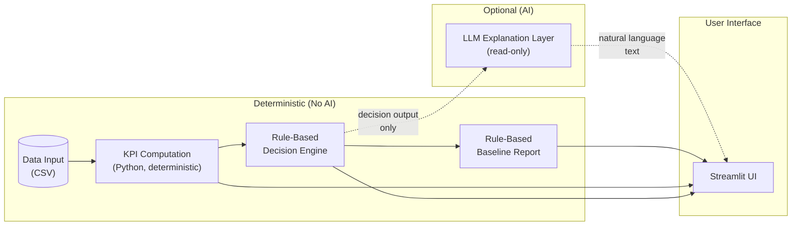

# System Architecture (Thesis Chapter 3)

## Figure: System Architecture Diagram

The following diagram can be rendered from the Mermaid source (e.g. in GitHub, VS Code with Mermaid extension, or online Mermaid editors) or redrawn in a vector tool for the thesis.



**Figure 3.1.** System architecture of the LLM-based decision support prototype. Solid arrows indicate mandatory one-directional data flow. Dashed arrows indicate the optional path: the rule-based decision engine outputs structured decisions to the LLM explanation layer, which produces natural language text for the user interface. All components inside "Deterministic (No AI)" operate without any machine learning; the LLM is the only AI component and is optional and read-only (it does not modify KPIs or decisions).

### Figure caption (standalone, for thesis)

**Figure 3.1 — System architecture.** One-directional data flow from Data Input (CSV) through KPI Computation (Python, deterministic), Rule-Based Decision Engine, and Rule-Based Baseline Report to the Streamlit User Interface. The Rule-Based Decision Engine is strictly separate from the Optional LLM Explanation Layer; the LLM receives only structured decision output and produces natural language text (read-only, optional). Components in the deterministic path do not use AI; the LLM is the only AI component.

### Alternative: ASCII diagram (no Mermaid)

```
                    ┌─────────────────────────────────────────────────────────────┐
                    │                  DETERMINISTIC (No AI)                       │
                    │                                                             │
  CSV  ──────────►  │  Data Input  ──►  KPI Computation  ──►  Rule-Based          │
                    │  (CSV)            (Python)              Decision Engine     │
                    │                                                │            │
                    │                                                │            │
                    │                                                ▼            │
                    │                                    Rule-Based Baseline      │
                    │                                    Report                  │
                    │                                                │            │
                    └────────────────────────────────────────────────┼───────────┘
                                                                     │
                         OPTIONAL (AI)                               │
                    ┌────────────────────┐                          │
                    │  LLM Explanation    │  ◄── decision output     │
                    │  Layer (read-only)  │  ──► natural language    │
                    └──────────┬──────────┘                          │
                               │                                     │
                               └──────────────────┬──────────────────┘
                                                   ▼
                                        Streamlit User Interface
```

---

## 3.1 Data Input

The system accepts business data in comma-separated value (CSV) format. The expected schema includes columns for time (order date), sales value, product identification, category, and region. Data preparation is minimal and deterministic to support reproducibility. Column names are normalized (whitespace trimmed; alternate names such as "Order Date" mapped to a canonical form) so that KPI computation can resolve required columns consistently. Date columns are parsed with a fixed convention (e.g. day-first) and invalid dates are coerced to missing; numeric columns are used in aggregation and converted to float where needed. The missing-value policy is explicit: rows with missing values in the date column or the sales column are dropped before KPI computation, so that all downstream results are based on a well-defined subset of the input. No imputation or inference is applied. This policy is documented in the implementation so that the same CSV yields the same cleaned dataset and thus the same downstream results.

---

## 3.2 KPI Computation

KPI computation is implemented in Python and is fully deterministic. It consumes the validated, cleaned dataset and produces a fixed set of key performance indicators using only the dataset columns. No machine learning or external APIs are involved.

KPI selection is justified by the business questions they answer: *time trends* (How do sales evolve over time? When did sales peak or bottom out?)—addressed by monthly sales trend, month-over-month change, peak month, and lowest month; *product mix* (Which categories and products drive revenue?)—addressed by top categories and top products by sales; *geography* (How is sales distributed across regions? Is there concentration risk?)—addressed by sales by region and region share; *anomalies* (Which periods deviate significantly from the observed pattern?)—addressed by z-score-based anomaly detection. Formulas and required columns are documented in a dedicated definitions module so that every reported value is traceable to a stated formula and input column. This module forms the numerical foundation for all subsequent steps; no component downstream may alter these values.

---

## 3.3 Rule-Based Decision Engine

The rule-based decision engine consumes the output of the KPI computation and applies a fixed set of rules to assign labels (e.g. positive trend, negative trend, stable, attention required) and to generate recommendations. All thresholds are *dataset-relative heuristics* used for consistent baseline comparison; they are *not* industry benchmarks or normative standards. Their purpose is to support reproducible, comparable evaluation of the LLM explanation layer, not to represent optimal decision-making. Each rule and threshold is documented with its rationale. The engine is implemented in deterministic code and does not use any AI. Its output is a structured decision result (fired rule identifiers, labels, rule explanations, and rule-generated recommendations) that is passed to the baseline report generator and, optionally, to the LLM. The decision engine is strictly separate from the LLM: the LLM never influences which rules fire or what labels are assigned.

---

## 3.4 Rule-Based Baseline Report

The rule-based baseline report generator takes the structured decision result as its sole input and produces a human-readable report by formatting the decision labels, rule explanations, and rule-generated recommendations. It does not introduce new logic or interpretation; it only renders the content provided by the decision engine. Numeric values are formatted consistently (e.g. with fixed decimal places) and without currency symbols. This report serves as the deterministic baseline against which any LLM-generated text can be compared in evaluation.

---

## 3.5 Optional LLM Explanation Layer

The LLM explanation layer is an optional component. **The LLM does not receive raw dataset rows.** It may receive only a deterministic KPI summary and the structured DecisionResult (labels, rule explanations, and recommendations) produced by the rule-based decision engine. This boundary is enforced in the implementation: the prompt is built exclusively from the decision summary text, which contains aggregated KPI values and decision outcomes, not row-level data. The role of the LLM is to produce natural language text that verbalizes these pre-computed outcomes. The LLM does not perform calculations, does not assign decision labels, and does not modify the baseline report. It is read-only with respect to the rest of the system. The pipeline is fully functional when this component is disabled; when enabled, its output is displayed alongside the baseline report for comparison.

---

## 3.6 Streamlit User Interface

The Streamlit user interface provides the entry point for loading CSV data, selecting scenarios (e.g. by region or category), triggering the pipeline, and viewing results. It displays the KPI table, the rule-based baseline report, and—if the LLM is enabled—the LLM-generated explanation. It also exposes expandable sections for KPI definitions, rule definitions, fired rules, and structured decision output, so that the provenance of every number and label is inspectable. The UI does not implement business logic; it only invokes the deterministic modules and, optionally, the LLM client, and renders their outputs.

---

## 3.7 System Integration and Data Flow

Data flows in one direction: from data input through KPI computation, the rule-based decision engine, and the rule-based baseline report, then to the user interface. The optional LLM explanation layer branches from the decision engine output and feeds only natural language back into the UI. There are no feedback loops: the LLM does not write into the KPI or decision modules, and no component upstream of the decision engine depends on the LLM. This unidirectional flow supports separation of concerns, traceability, and reproducible evaluation of the LLM as an explanation layer against the deterministic baseline.

---

## 3.8 Implementation Mapping

The following table maps each architectural module to the repository files that implement it.

| Module | Repository files |
|--------|------------------|
| Data loading | `app.py` (CSV load, scenario filter) |
| KPI computation | `kpi.py`, `kpi_definitions.py` |
| Decision rules | `decision_engine.py` (including `RULE_DEFINITIONS`) |
| Baseline report | `rule_based_report.py` |
| LLM explanation layer | `llm_client.py`, `prompts.py` |
| Evaluation | `evaluation.py` (hallucination detection, rubric, CSV export) |
| User interface | `app.py` (Streamlit) |

Data loading and the Streamlit UI are both implemented in `app.py`; the remaining modules correspond to dedicated modules as listed.

---

## Design Rationale

- **Deterministic core:** All KPIs and all decision labels are produced by deterministic code so that results are reproducible and auditable without dependence on AI.
- **Explicit AI boundary:** The only AI component is the LLM explanation layer; it is optional and read-only, so the system can be operated and evaluated with or without it.
- **Input boundary for the LLM:** The LLM receives only a deterministic KPI summary and the structured DecisionResult (labels, explanations, recommendations); it does not receive raw dataset rows.
- **Separation of decision and explanation:** The rule-based decision engine is strictly separate from the LLM; the LLM only verbalizes pre-computed outcomes and never influences which rules fire or what labels are assigned.
- **One-directional data flow:** The architecture avoids feedback loops and ensures that each module has a well-defined input and output.
- **Baseline for evaluation:** The rule-based baseline report provides a deterministic reference so that LLM output can be evaluated on clarity, correctness, usefulness, and hallucination.
- **Traceability:** KPI definitions, rule definitions, fired rules, and structured decision output are exposed so that every number and label can be traced to a stated formula or rule.
- **Dataset-relative thresholds:** Rule thresholds are heuristics for baseline comparison, not industry benchmarks; this supports academic clarity and reproducible comparison.
